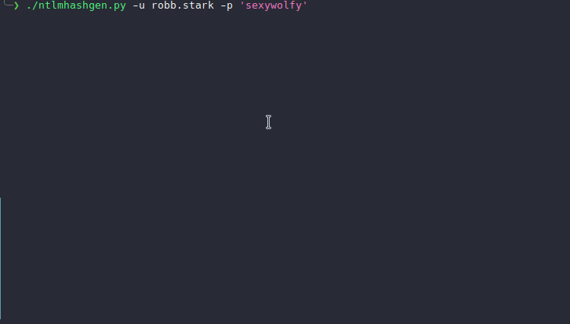

# **NTLM Hash Generator Script**

## Overview

This Python script is designed to generate several types of hashes for given credentials. It specifically computes LM and NT hashes using the NTLM protocol, SHA1 hashes, and Microsoft Domain Cached Credentials (MSDCC2) hashes, which are useful for network security testing and penetration testing tasks.

## Features

* Hash Generation: Computes LM, NT, SHA1, and MSDCC2 hashes for provided credentials.
* Colorful Output: Outputs hash results in random colors to enhance readability and user experience.
* Command-line Interface: Fully functional command-line interface for easy use in scripts and testing setups.
* Secure Hashing: Uses reliable and secure libraries to compute hashes.

## Prerequisites

To run this script, you need:

* Python 3.x installed on your system.
* The colorama, passlib, hashlib, and impacket libraries installed in your Python environment. 

These can be installed via pip:
```bash
pip install colorama passlib impacket
```

## Installation

Clone this repository or download the script to your local machine. Make sure all required libraries are installed:

```bash
git clone https://github.com/your-repository/NTLM-Hash-Generator.git
cd NTLM-Hash-Generator
pip install -r requirements.txt  # Assuming you have a requirements.txt with all needed packages
```


## Usage

The script is executed from the command line with the following parameters:

* **-p**, **--password:** Specifies the password to hash.
* -**u**, **--username:** Specifies the username for which to compute the MSDCC2 hash (necessary for generating this type of hash).

```bash
python ntlm_hash_generator.py -u username -p password
```



This command will generate LM, NT, SHA1, and MSDCC2 hashes for the provided username and password, outputting the results in randomly colored text.

## How It Works

1. **Command Parsing:** The script parses command-line arguments for a username and password.
2. **Hash Computation:**
		* **LM and NT Hashes:** Uses the impacket library's functions to compute these hashes based on the NTLM protocol.
		* **SHA1 Hash:** Uses Python's hashlib to compute a SHA1 hash of the password.
		* **MSDCC2 Hash:** Utilizes passlib to compute the Microsoft Domain Cached Credentials hash, which requires both username and password.
		* **Output:** Displays each hash type with its corresponding value in a color that changes with each run of the script.

## Customization

**Colours:** Colours are randomly chosen from predefined options within the script to display each hash output. Modify the colors list in the script to customize the available colors.

---
